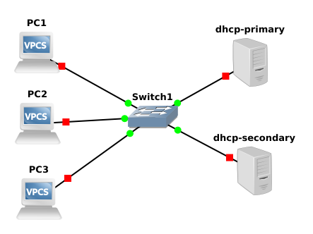

# DHCP Failover

Project: 'DHCP Failover' created on 2020-12-06
Author: Michal Šrubař <mmsrubar@gmail.com>

A simple implementation demonstrating an ISC DHCP failover using one primary and
one secondary server. DHCP servers are implemented as docker images build in the
docker hub and downloaded from there. Server are assigning IPs from pool
192.168.210.10 - 192.168.210.240.

- [Docker image for primary server:](https://hub.docker.com/repository/docker/mmsrubar/dhcp-failover-primary "Docker image for primary server:")
- [Docker image for secondary server](https://hub.docker.com/repository/docker/mmsrubar/dhcp-failover-secondary "Docker image for secondary server")

