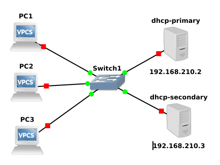

# DHCP Failover

Project: 'DHCP Failover' created on 2020-12-06
Author: Michal Šrubař <mmsrubar@gmail.com>

This is a simple implementation demonstrating a ISC DHCP Failover using one
primary and one secondary server. DHCP servers are implemented as docker images
build in the docker hub and downloaded from there.  Server are assigning IPs
from pool 192.168.210.10 - 192.168.210.240. 

