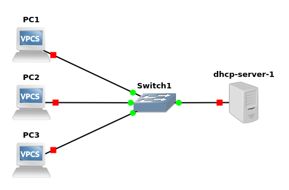

# Simple DHCP server

Project: 'simple-dhcp-server' created on 2020-12-06
Author: Michal Šrubař <mmsrubar@gmail.com>

Simple DHCP server assigning IPs from pool 192.168.210.10 - 192.168.210.240. The DHCP server is implemented as a docker container that is downloaded from mmsrubar/simple-dhcp-server. The Dockerfile is maintained here and build on the docker hub automatically.

